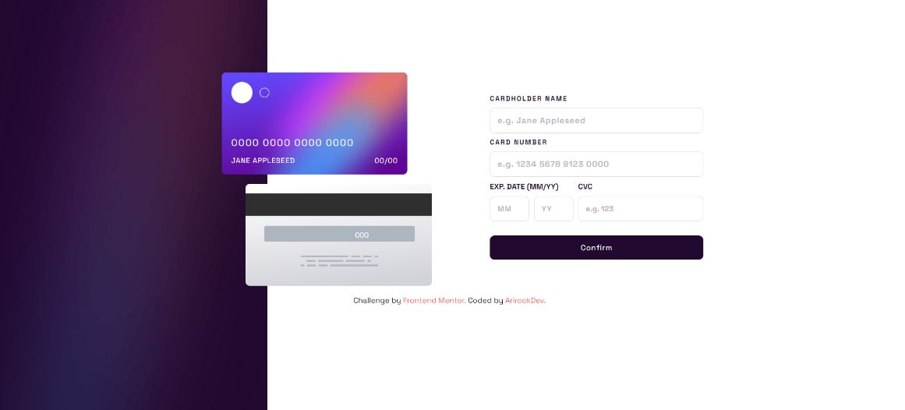
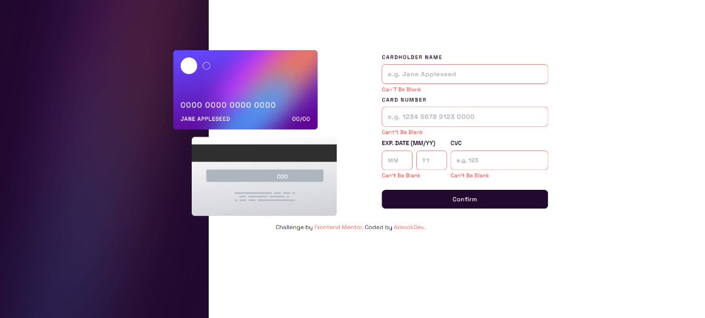
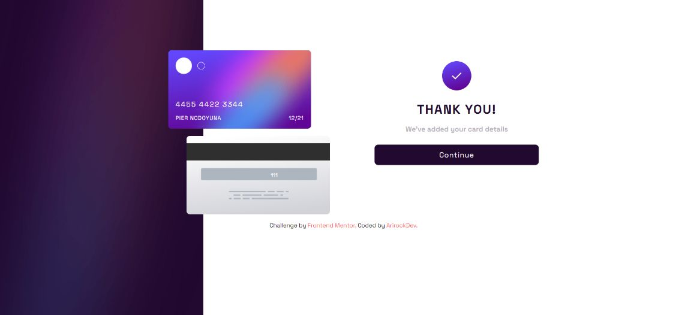

# Frontend Mentor - Interactive card details form

## Welcome! 👋

Thanks for checking out this front-end coding challenge.

I used for this challenge:
    
  HTML  

  CSS

  Javascript

Screenshot

**Have fun building!** 🚀
